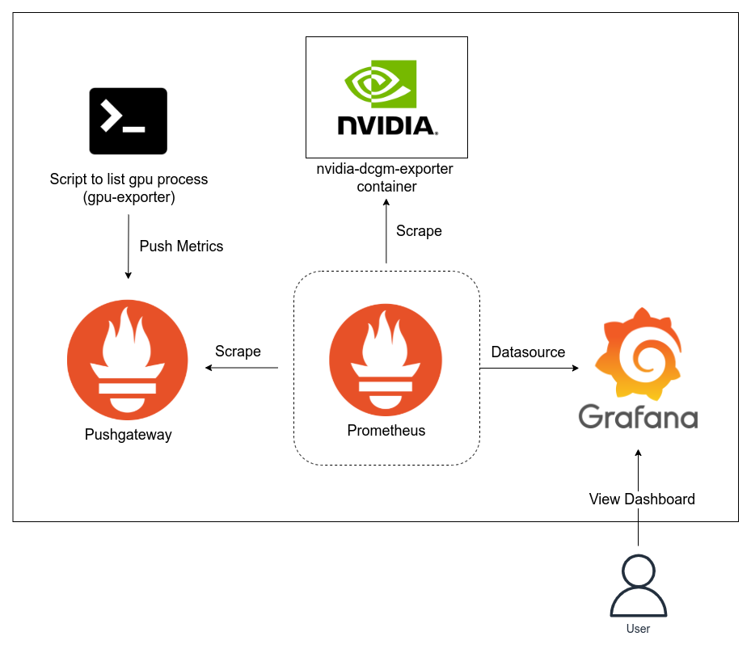
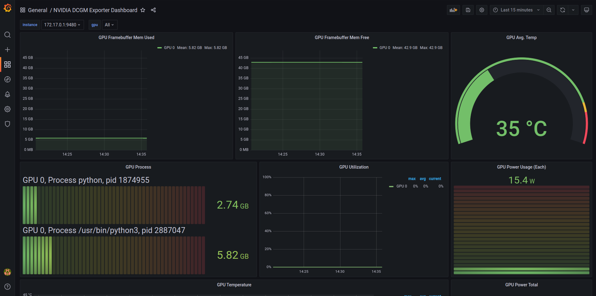

# GPU Monitoring Stack Docs

This stack provides `docker compose` manifest to monitor GPU metrics and running process that use the GPU. The architecture of this monitoring stack is as follow,



## Prerequisite

1. Installed Docker on Host Machine
2. Have at least 1 GPU on the server

## Overview

This monitoring stack can be divided into 3 parts,

1. Metrics Generator (gpu-exporter,  nvidia-dcgm-exporter, and Pushgateway)
2. Prometheus as time-series database (datasource to Grafana)
3. Grafana as a tool to visualize the data collected by prometheus

The flow of monitoring is as follows,

1. Start Pushgateway container as a storage for custom metrics.
2. GPU exporter push the metrics created by the scripts to prometheus pushgateway.
3. Start `nvidia-dcgm-exporter` container to expose gpu status metrics.
4. Prometheus scrape metrics from Pushgateway and dcgm container every 15 seconds (can be customized).
5. Start Grafana container and use Prometheus as a Datasource, [import custom dashboard](#grafana-dashboard) created to Grafana.
6. User or administrator view the dashboard on grafana.

## How to Run

1. Create volume for grafana

    ```bash
    docker volume create grafana-storage
    ```

2. Check for docker network interface subnet.

   Check `gpu_ps.py` and make sure to align the Host IP. For example, if docker network interface on host is `docker0` with `172.17.0.1/16` subnet, then you should write `172.17.0.1` on line 34.

3. Run with `docker-compose up -d`

## Prometheus Config

Prometheus [config](prometheus/prometheus.yml) can be customized to add alerting or add additional hosts in `scrape_configs` (if you want to monitor >1 servers).

## Import Grafana Dashboard

You can import either the [custom dashboard](gpu-custom-dashboard.json) or use the [default dashboard](https://grafana.com/grafana/dashboards/12239) for DCGM Exporter (you need to setup additional panel to list the GPU process exposed by `gpu-exporter`)

## Dashboard Overview

Dashboard View

