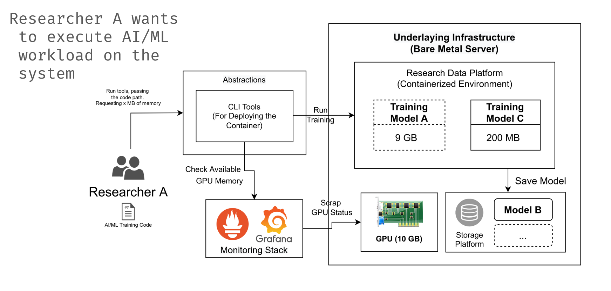

# GPU Research Data Platform Docs

This platform make it possible for researchers to run multiple model with various memory requirements all at once. The architecture of this platform and the use case is as follow,



Here, the abstraction could be any platform that support multi-tenancy (in the sample script, we use portainer and we create script using python).

The Platform itself is divided into 2 parts, first is the server components and the second one
is client components.

## Server Components
There are 3 main components that need to be installed on the server-side. The three
components are Docker as a container engine, Portainer as a Platform to manage container
workload, and Minio as a storage solution for storing models. Apart from the three
components, a Monitoring Stack for GPU should be deployed to monitor GPU usage and
activity.

### Server Components Installation
Docker is the core component of this system. Docker is used as a container engine to run
containers on the server. Docker installation should be straightforward as defined [on the documentation](https://docs.docker.com/engine/install/). If the server is using linux, the installation could be done by downloading the
get docker script and executing it.

    curl -fsSL https://get.docker.com -o get-docker.sh | sudo sh

We use Portainer to handle user access to the container environment. The installation step
is simple, you can just use the Portainer docker image and run with some flags as defined
on the [official documentation](https://docs.portainer.io/v/ce-2.11/start/install/server/docker/linux).

For the storage solution of the trained model, you can deploy a simple minio server using
[docker](https://docs.min.io/docs/minio-docker-quickstart-guide.html) or [docker-compose](https://docs.min.io/docs/deploy-minio-on-docker-compose) (distributed) as defined on the minio documentation.
## Client Components

Client-side components consist of a simple script to check and schedule GPU workload to the
Platform. The script have 3 prerequisite before executed,

1. API Token to communicate with the Platform
2. The host should be able to communicate with Prometheus API in the Monitoring Stack
3. The host where the script executed should be able to copy file via `scp` to `/tmp`
directory of the Platform

After that, make sure to check the python source code to align with the sample supported
source code. This is because the script has to inject a standardized code to meet the user
request for limiting gpu memory usage and inject code to have the model saved somewhere.

## Getting The Platform API Token
The documentation on how to get API Token from Portainer is on [this link](https://docs.portainer.io/v/ce-2.11/api/access). 

## Sample of Supported Source Code Convention
This is the sample of source code that is supported in the created system. 

```py
#!/usr/bin/env python
# coding: utf-8
import tensorflow as tf
from tensorflow import keras
import numpy as np

# loading dataset
fashion_mnist = keras.datasets.fashion_mnist
(train_images, train_labels), (test_images, test_labels) =
fashion_mnist.load_data()

# scaling
train_images_scaled = train_images / 255.0
test_images_scaled = test_images / 255.0

# define the get_model function to return the "model"
def get_model(hidden_layers=1):
    # Flatten layer for input
    layers = [keras.layers.Flatten(input_shape=(28, 28))]
    # hideen layers
    for i in range(hidden_layers):
        layers.append(keras.layers.Dense(500, activation='relu'),)
    # output layer
    layers.append(keras.layers.Dense(10, activation='sigmoid'))
    model = keras.Sequential(layers)
    model.compile(optimizer='adam',
        loss='sparse_categorical_crossentropy',
        metrics=['accuracy'])
    return model

# Using the previous defined function, create this
# code to define that you want to use GPU for
# training the model. Store the model on "model" variable

### GPU
with tf.device('/GPU:0'):
 model = get_model(hidden_layers=5)
 model.fit(train_images_scaled, train_labels, epochs=10) 
```

Running the `gpu-split-latest.py` with the correct parameter will add some additional code to the python code above, save and run the modified file to enable memory limiting.

## How to Use

Use script on `gpu-split-latest.py`. If minio is not installed, use `gpu-split-prototype.py` instead

The script have several commands to be used,

### Run

This command is to run the AI/ML training using the defined python source code.

    python gpu-split-latest.py run

You have to prepare the name of the container, python code location on host, and define
how much memory you need in MiB.

### Stop
This command is to stop the AI/ML workload.
    
    python gpu-split-latest.py stop

You have to prepare the name of the container that wants to be stopped.
### Delete
This command is to delete the AI/ML workload.

    python gpu-split-latest.py delete

You have to prepare the name of the container that wants to be deleted.
### Logs
This command is to view the AI/ML workload logs.

    python gpu-split-latest.py logs

You have to prepare the name of the container that wants the logs to be viewed. 